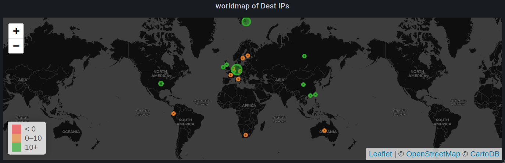
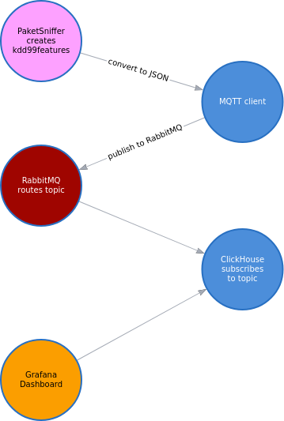
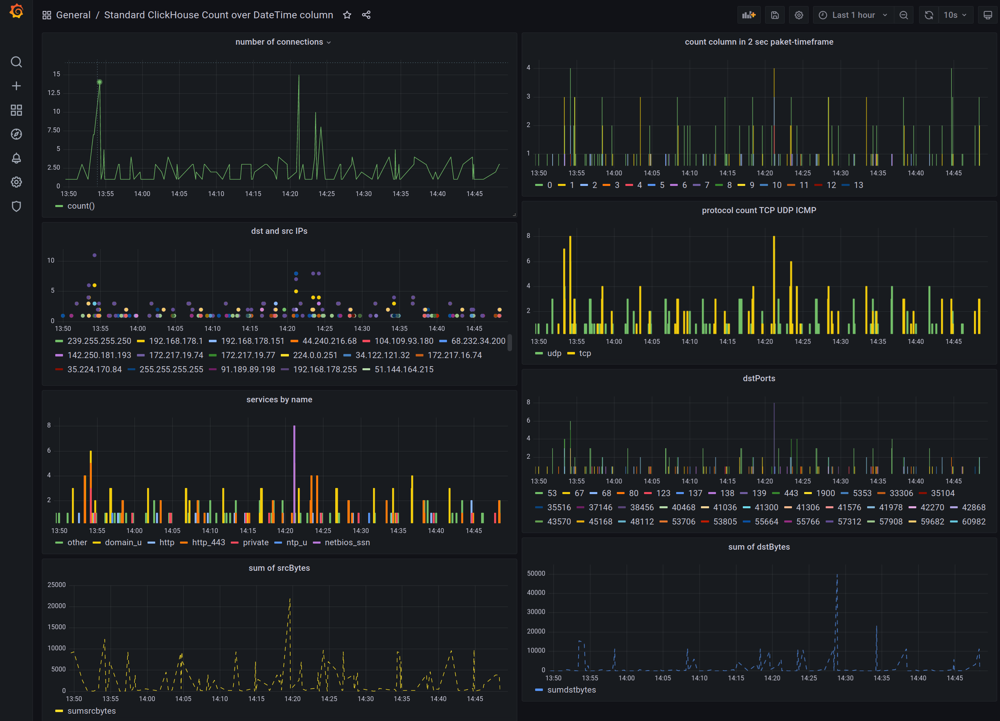
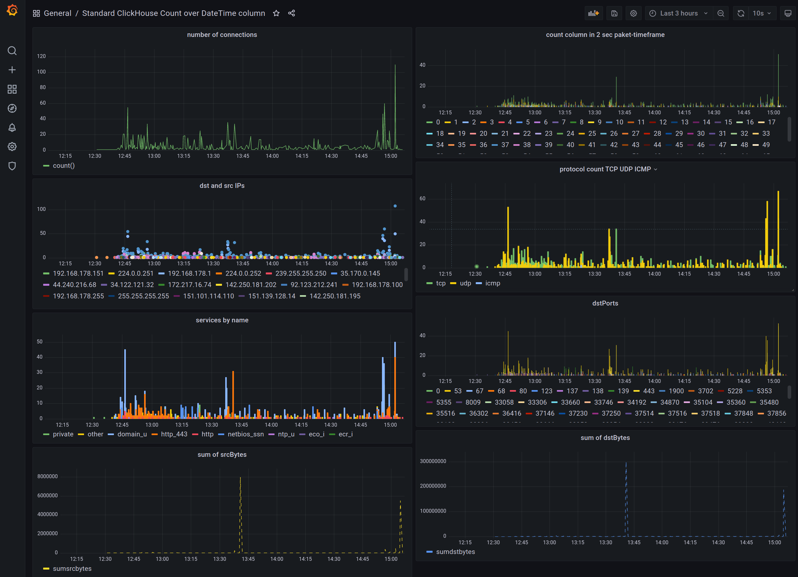
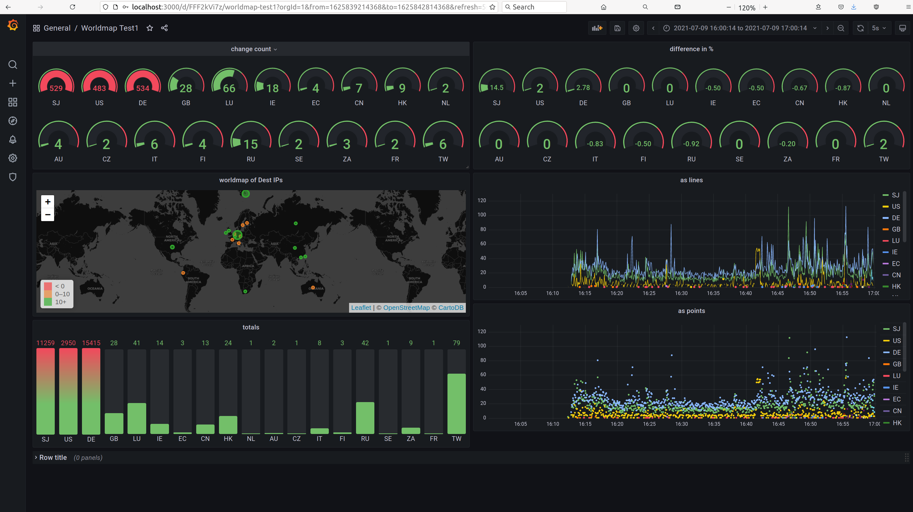

# kdd99_via_mqtt_to_rabbitMQ_to_ClickHouse_to_Grafana

# use kdd99 features to display Dashboard of features and/or Destination IPs on the world-map plugin of Grafana

- kdd99 via mqtt to rabbitMQ to ClickHouse to Grafana Dashboard :)

- go to src -> run ./COMPILE.sh
- install/setup ClickHouse
- install/setup RabbitMQ
- install Grafana and install ClickHouse plugin, see grafana_dashboard.json for queries
- (maybe change RabbitMQ/MQTT broker connection string and topic in TinyMqtt.cpp)
- run ./kdd99extractor 

see [Documentation](Documentation.pdf) for Details, like ClickHouse table creation

- for worldmap install (apt install libmaxminddb-dev)
